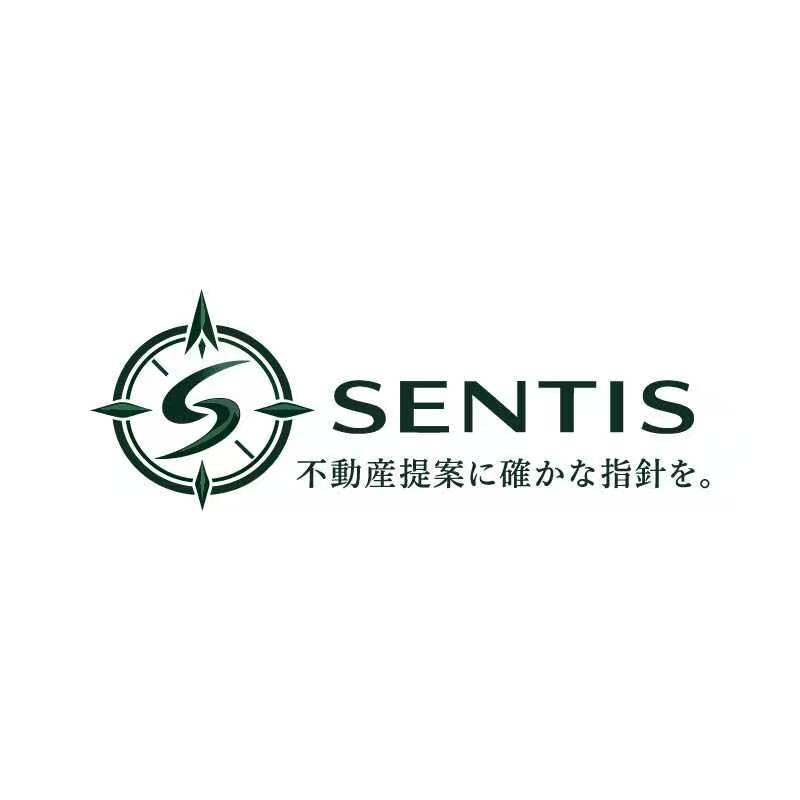

# [sentis-crm-system] Sentis 房产中介内部综合业务管理系统规划

> **案例标识**：`sentis-crm-system`  
> **所属分类**：产品规划与业务架构  
> **负责人**：Vanguard 平台架构组  
> **创建日期**：2026-10-03 | **更新日期**：2026-10-03  
> **当前状态**：`详细设计与方案评审阶段 (M2 阶段进行中 / 预计 11/30 上线验收)`  
> **原始材料**：
> - [`創業計画書.pdf`](../raw/創業計画書.pdf)（株式会社 SENTIS 商业计划、财务指标与定位）
> - [`売買契約の流れ.docx`](../raw/売買契約の流れ.docx)（买卖签约、本审查、金融契约、决算全流程要求）
> - [`売買契約流れ　ローン利用.pdf`](../raw/売買契約流れ　ローン利用.pdf)（银行贷款利用专项实务指南）

---

## 1. 案例执行摘要与商业背景

### 1.1 株式会社 SENTIS 企业画像
根据最新归档的《株式会社 SENTIS 創業計画書》，公司核心基本面如下：

- **公司全称**：株式会社 SENTIS（センティス）
- **设立时间**：令和8年（2026年）5月18日
- **法定地址**：东京都千代田区神田须田町 2-3-12 12KANDA 705
- **代表取缔役**：**阿部 翔平 (Shohei Abe)**
  - *2014.04 - 2017.03*：防卫省 航空自卫队 作战情报队 第二收集队 军职经历，具备极强的流程严密性与纪律性。
  - *2017.04 - 2025.04*：任职于株式会社リノベスト（Renovest）约 8 年，历任新筑分让公寓销售代理责任者、法人业务总监，主导 2～10 亿日元高额不动产交易、多媒体视频广告营销，具有宅地建物取引士资质。
- **注册资本金**：5,000,000 円
- **服务语言**：日语、英语、中文（简体字 / 繁体字）

### 1.2 商业战略定位：小而美的超高人效“高额海外不动产中介”
Sentis 不做低客单价的粗放扫街中介，而是依托**“五维一体”的核心壁垒**切入蓝海：

```text
┌────────────────────────────────────────────────────────────────────────┐
│                          SENTIS 五维核心竞争力                         │
├────────────────────────────────────────────────────────────────────────┤
│  1. 高额物件中介 (2~10 億円)  ── 依托代表 8 年法人关系网络与房源获取能力│
│  2. 海外富裕层客户 (中国/台湾)── 懂海外习惯、破除跨国交易与法律文化壁垒│
│  3. 多语言无缝服务 (中/日/英) ── 从咨询、VR 看房到重要事项说明与售后   │
│  4. 视频与 VR 营销战略        ── 跨越地理距离，面向海外远距离线上签约  │
│  5. 小红书 (RED) 精准集客     ── 自建私域社群与在日华人富裕层转介绍基盘 │
└────────────────────────────────────────────────────────────────────────┘
```

---

## 2. 财务目标与轻量团队人效挑战

《創業計画書》中明确了公司未来 3 年的中期事业计划与目标：

| 经营阶段 | 目标年营收 | 预估营业利润 | 团队全职人数 | 人均创收 (人效) | 核心战略重心 |
| :---: | :---: | :---: | :---: | :---: | :--- |
| **第 1 期** | **7,150 万円** | 5,590 万円 | **2 名** | **3,575 万円/人** | 业务基盘构建、跑通小红书获客与签约 SOP |
| **第 2 期** | **1 亿 5,000 万円**| 1 亿 2,000 万円 | **3 名** | **5,000 万円/人** | 增员 1 人，放大高额不动产与转介绍网络 |
| **第 3 期** | **3 億円** | 2 亿 4,000 万円 | **5 名** | **6,000 万円/人** | 建立海外战略合作伙伴网络，持续规模化 |

### 核心系统挑战：极小团队如何支撑亿级交易？
1. **人均产能极高**：第 1 期仅 2 人要跑通年均近 20 笔大额成约（海外买卖 12 笔 + 高额物件 5 笔 + 法人案件）。
2. **零容错率**：涉及 2~10 亿日元的高额交易，任何一个资料缺漏、时间节点失误或印纸税纰漏，都会导致数百万日元的手续费争议甚至法律纠纷。
3. **消除沟通与备忘成本**：不能让创始人与担当经纪人把宝贵时间耗费在翻找 Excel、口头提醒住民票番号或反复确认公章带出等琐事上。

---

## 3. 内部管理系统定位：Sentis Realty Core

针对上述实际商业背景，管理系统必须超越普通的记事本工具，定位为**“公司专属的交易流水线导航与风控辅助引擎”**：
- **前链路贯通**：从小红书/转介绍客户意向 ➔ 远程 VR 咨询 ➔ 意向申购与事前审查跟踪。
- **中链路核验**：买卖契约 ➔ 银行房贷审查（或海外资金合规入境跟踪）➔ 金融金消 ➔ 决算交房全自动 Checklist 与倒排工期。
- **纯本地极简交付**：无需架设复杂服务端与云数据库，依托 Vanguard 本地优先与纯静态产物规范，本地即刻运行。
- **清晰边界意识**：系统定位于内部高人效辅助工具，不越界替代银行专属贷款系统、法务局登记网关或专任宅建士法定责任；对于海外资金管制、公证周期及涉外税务等未定事项，预留弹性协议与线下审核接口。

---

## 4. 品牌 CI/VI 视觉体系与 Logo 资产规范

### 4.1 品牌图腾与核心寓意
株式会社 SENTIS 确立了以**“罗盘（Compass / 羅針盤）与核心英文字母 S”**为核心图腾的企业标志：



- **罗盘指针 (The Compass Needle)**：四方罗盘刻度与北方锋芒，象征在瞬息万变的全球宏观经济与东京不动产市场中，为海内外投资者与购房家庭锚定最具确定性的核心资产。
- **字母 S 动势 (The S Curve)**：融合 SENTIS 首字母，兼具 Security（合规安全）、Speed（敏捷人效）与 Specialist（专任宅建士）三重内涵。
- **品牌格言 (Slogan)**：**「不動産提案に確かな指針を。」**（为不动产提案提供确切的指针）。
- **标准色系 (Brand Palette)**：
  - **主色 (Forest Deep Green)**：`#184332`（沉稳典雅的森林墨绿，代表资产稳健与长期信赖）
  - **辅色 (Official Ink Black)**：`#1a1e24`（庄重内敛的日式公文墨黑）
  - **底色 (Parchment Washi Cream)**：`#fbf9f4`（温润的和纸羊皮纸色，烘托传统不动产事务所纸质厚重感）
  - **印鉴色 (Seal Cinnabar Red)**：`#b82c2c`（朱砂红印，用于契印、消印与专任宅建士确权）

### 4.2 衍生生成的多规格素材清单 (Assets Suite)
所有衍生多尺寸、透明抗锯齿素材均统一维护于 [`site/assets/logo/`](../site/assets/logo/) 目录中：

| 资产文件 | 规格 / 尺寸 | 适用场景 |
| :--- | :--- | :--- |
| [`sentis-emblem-512.png`](../site/assets/logo/sentis-emblem-512.png) | 512×512 (PNG透明) | 高清印刷、大屏展示、Retina 视网膜矢量占位 |
| [`sentis-emblem-256.png`](../site/assets/logo/sentis-emblem-256.png) | 256×256 (PNG透明) | 系统关于弹窗、高分辨率应用图标 |
| [`apple-touch-icon.png`](../site/assets/logo/apple-touch-icon.png) | 180×180 (PNG) | iOS / iPad / Android 桌面书签高清图标 |
| [`sentis-emblem-64.png`](../site/assets/logo/sentis-emblem-64.png) | 64×64 (PNG透明) | 样板网站 Header 顶栏品牌徽标、侧边栏水印 |
| [`sentis-emblem-32.png`](../site/assets/logo/sentis-emblem-32.png) | 32×32 (PNG透明) | 侧边栏抽屉标头、紧凑型状态栏图标 |
| [`favicon.ico`](../site/assets/logo/favicon.ico) | 32×32 (Windows ICO) | 浏览器标签页原生图标（根目录 [`site/favicon.ico`](../site/favicon.ico) 同步生效） |
| [`sentis-logo-full-800w.png`](../site/assets/logo/sentis-logo-full-800w.png)| 800×312 (PNG透明) | 正式公文信头、大画幅横幅 Header、重要事项说明书抬头 |
| [`sentis-logo-full-400w.png`](../site/assets/logo/sentis-logo-full-400w.png)| 400×156 (PNG透明) | 移动端信头、商业计划书 PPT 封面标志 |

