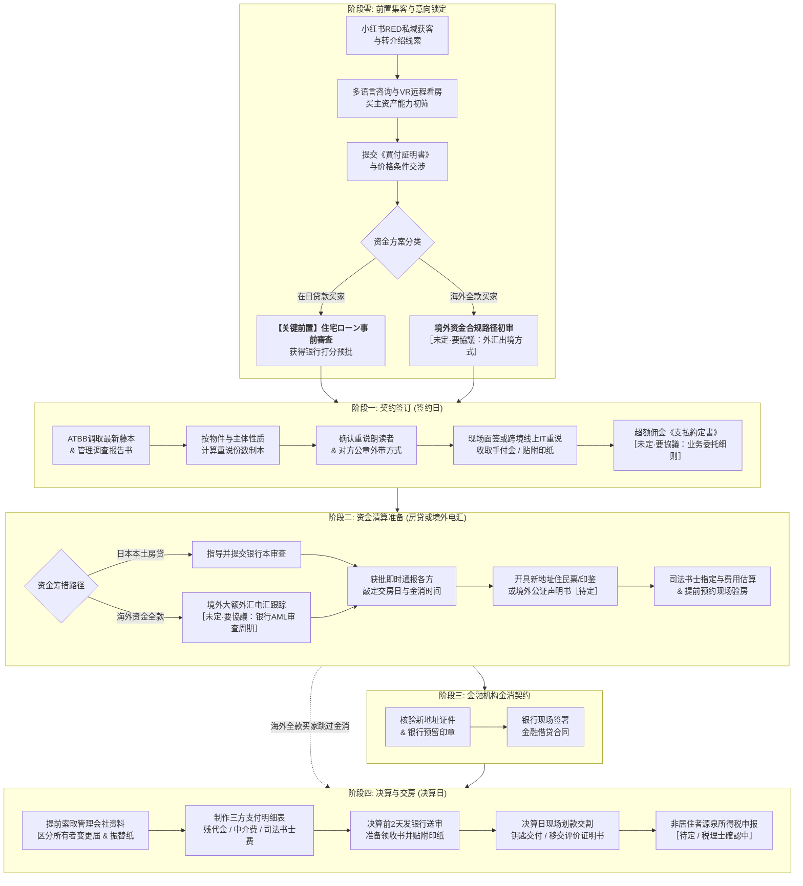

# Sentis 房产买卖全生命周期业务链路与 SOP 规范拆解

本文档整合自 Sentis 公司两套核心业务基准文件：
1. 《株式会社 SENTIS 創業計画書》（商业定位、海外华人获客与高额不动产交易模式）
2. 《売買契約の流れ》、《売買契約流れ　ローン利用》（日本不动产交易、房贷审批与决算实务 SOP）

---

## 1. 业务全链路全景流程图 (含关键待定节点)

---

## 2. 差异化业务场景矩阵 (国内在日客户 vs 海外非居住者)

> [!WARNING]
> **海外客户业务现实制约与风控说明**：
> 相比境内贷款交易，海外客户跨国置业存在诸多**不可控的现实合规摩擦**，系统与业务 SOP 绝不可将其理想化：
> 1. **外汇出境管制与锁汇风险**：中国大陆存在每人每年 5 万美元外汇便利化额度限制，大额资金（数千万至数亿日元）跨境调资路径极具复杂性与不确定性；
> 2. **日本受款银行严苛的 AML (反洗钱) 审查**：日本各大银行对海外大额汇入款项审查周期通常需要 2~4 周，且随时可能要求补充完税证明、资金来源合法声明，存在滞留或退汇风险；
> 3. **公证认证属地政策差异**：境外公证处出具公证书及附加证明书（海牙认证 Apostille）周期波动极大，且格式必须经日本法务局认可；
> 4. **涉税合规**：非居住者转让房产或收取租金涉及 10.21% 或 20.42% 预提所得税源泉征收，相关申报细则目前处于［待定 / 税理士確認中］。

| 校验维度 | 分支 A：日本国内居住客户 (在日华人/日本人) | 分支 B：海外非居住者 (中国大陆/台湾等境外买主) | 当前决策状态 |
| :--- | :--- | :--- | :---: |
| **法定身份凭证** | 在留卡、日本驾照、健康保险证 | 境外护照原件及复印件（需核对护照有效期限） | ● 已确定 |
| **印鉴与住址证明** | 市区役所开具的《住民票》与《印鉴登录证明书》 | 当地公证处出具的《公证书》（声明书/签字公证本）及海牙认证本 | ⚡ ［未定・要協議：认证格式］ |
| **资金付款模式** | 商业银行住宅贷款（事前审查 ➔ 本审查 ➔ 金消） | 境外外汇电汇全款（受款行反洗钱合规预审） | ⚡ ［未定・要協議：AML缓冲期］ |
| **重要事项说明** | 线下中介会面，现场朗读重要事项说明书 | 线上 IT 重说（录音录像 + 提前邮寄原本回签） | ● 已确定 |
| **跨境税务合规** | 适用日本居民常规税制（确定申告） | 非居住者源泉税征收扣缴义务与税理士委任 | ⚪ ［待定 / 税理士確認中］ |

---

## 3. 四大核心业务阶段标准化 SOP

### 阶段一：契约签订 (签约时)

| 责任方 | 准备事项与清单 | 份数与操作细则 | 避坑与关键风控提示 |
| :--- | :--- | :--- | :--- |
| **公司/担当** | **重要事项说明书** | 3~4 份 | 卖主为法人/企业物件备 3 份；个人物件备 4 份。我方可保留复印版。 |
| **公司/担当** | **売買契約書** | 2 份 | 1 份制本原本，1 份朗读本。由印纸负担方（通常为买主）持有原本。 |
| **公司/担当** | **一般媒介契約書** | 买主、卖主各 2 份 | 担当自行制作。 |
| **公司/担当** | **最新登記事項証明書 (藤本)** | 1 份 | 必须通过 ATBB 调取最新版本。 |
| **公司/担当** | **重要事項調査報告書** | 1 份 | 公寓管理会社出具，非必要不重复调取，可电话核实。 |
| **公司/担当** | **支払約定書** | 1 份 | 卖主手续费超过 3% 部分必须以业务委托形式签订。 |
| **公司/担当** | **设备表 & 物件状况报告书** | 各 2 份 | 卖方提供，打印 1 份或按规范制本。 |
| **买主客户** | **身份证明文件** | 原件 | 在留卡、驾照（国内客户）或护照（海外客户）。 |
| **买主客户** | **实印 / 公证签字** | 1 枚 | 必须与印鉴证明或声明书一致。 |
| **买主客户** | **手付金 (定金)** | 约定金额 | 现金或银行转账，必须提前与卖主确认交割方式。 |
| **买主客户** | **收入印纸** | 对应面额 | 提前在邮局购买（按契约金额区间对应税额）。高额房产印纸税额较高需格外注意。 |
| **买主客户** | **住民票** | 1 份 | 仅当购买**新筑一户建**时当天必须提供（**不含个人番号**）。 |

> [!NOTE]
> **签约核心协作核查点**：
> 1. 确认是由我方宅建士朗读重说，还是卖方中介朗读（大部分由 Sentis 朗读）。
> 2. 确认对方中介公章能否带出。若不可带出，须提前将重说、契约书、设备表等 PDF 发送给对方，由对方自带制本盖章原本至现场。

---

### 阶段二：银行房屋贷款本审查 (本審査) / 跨境资金调度

| 节点任务 | 执行细则与风控要求 |
| :--- | :--- |
| **资料前置核验** | 银行贷款：根据合作银行清单严格核验收入凭证与纳税原件；海外全款：确认跨境送金银行路径与锁汇周期。 |
| **获批即时通报** | 本审查批复下达后，**必须第一时间**同时通知客户与卖方中介，锁定确定性。 |
| **交房日程商谈** | 立即与卖方中介协商最终交房决算窗口，并向银行预约金消契约与决算排期。 |
| **新地址迁入指导** | 指导买主办理**新地址变更**，开具新住民票（**绝不可包含个人番号**）及印章证明。新筑一户建需向卖方核实准确门牌。 |
| **司法书士对接** | 确认由哪方指定司法书士： • 我方指定：提前准备买卖契约、藤本、固定资产评价证明书交付，并报备卖方中介。 • 双方分别指定（银行指定+卖方指定）：提前完成双司法书士的联络拉通。 |
| **验房日程确认** | 新筑一户建或翻新翻转物件，**必须尽早预约验房**，最迟不得晚于交房日前 2 周。 |
| **残代金结算通知** | 提醒卖方中介尽快制作出具正式《残代金案内》。 |

---

### 阶段三：金融机构借贷合同 (金消契約)

| 准备项 | 说明与核对关键 |
| :--- | :--- |
| **新地址住民票** | 必须完成地址变更后的新版本，**严禁显示个人番号**。 |
| **新地址印鉴证明** | 必须由新住址管辖役所开具。 |
| **银行卡印章** | 必须携带开立还款账户时预留的印章（若与实印不同切勿带错）。 |
| **身份与社保凭证** | 健康保险证、在留卡/驾照/护照等本人确认资料原件。 |

---

### 阶段四：决算与产权交割 (決算・引渡し)

| 环节 | 关键动作与要求 | 责任与交付物 |
| :--- | :--- | :--- |
| **公寓管理手续** | **提前致电管理会社索取**： 1. 《区分所有者变更届》 2. 《管理费+修缮费振替用纸》 ⚠️ 邮寄需要时间周期，必须在决算前提前充足时间申请，并备好贴足邮票的回邮信封。 | 避免交房后物业费扣缴与业主登记脱节。 |
| **手续费请求** | 卖方若有中介费，提前向卖方出具正规请求书及我司收款账户信息。 | 财务结算准备。 |
| **决算案内制作** | 统筹汇总买方应付各项税费、尾款，提前制作《决算案内》，明确转账与备用现金金额。 | 确保客户资金按时到账。 |
| **支付明细整合** | 汇总三大支付明细： 1. 支付给卖方的房款尾款（残代金） 2. 支付给我司的中介服务费 3. 支付给司法书士的登记报酬与登记免许税 合并为一个 PDF，命名规则：`[客户名]+[决算日期]+的决算资料.pdf`。 | **决算前 2 天发给负责人并送审银行**；决算前 1 天将纸质原件移交负责人。 |
| **领收书与印纸** | 准备买卖双方各 1 张领收书，加盖公章并贴附印纸： • 金额 < 100 万円：贴 200 円印纸 • 金额 ≥ 100 万円：贴 400 円印纸（即 2 张 200 円） | 严格遵守日本印纸税法规范。 |
| **评价证明书移交** | 我司指定司法书士时，公寓类物件必须找卖家索取《固定资产税评价证明书》原件，于决算现场交付司法书士。 | 保证当日产权转移登记顺畅。 |
