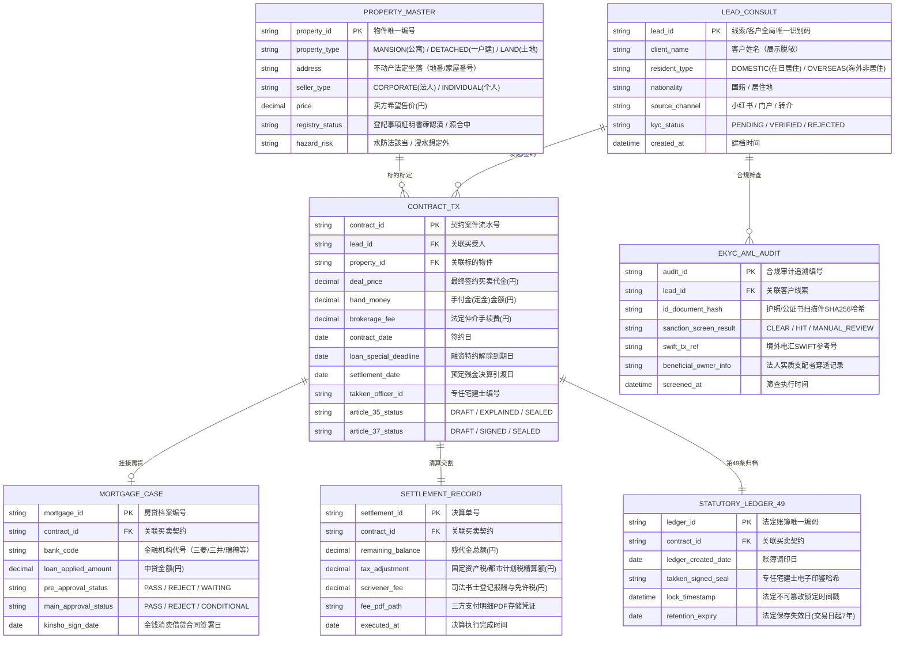

# Sentis 内部综合管理系统功能规划与系统设计 (Sentis Realty Core)

## 1. 架构定位：服务于 2~5 人轻量团队的“超高人效指挥中心”

根据《株式会社 SENTIS 創業計画書》，公司第 1 期团队仅由代表阿部翔平与核心成员共 2 人组成，目标却要达成 7,150 万円营收。因此 **Sentis Realty Core** 系统的第一设计原则是：**杜绝形式主义，专注于消除大额交易中的人肉备忘与操作失误，实现单兵人效最大化。**

```text
┌────────────────────────────────────────────────────────────────────────┐
│                        Sentis Realty Core 模块矩阵                     │
├────────────────────────────────────────────────────────────────────────┤
│  1. 客户与线索中心 (Lead & Client Hub)                                 │
│     • 小红书 (RED) 私域线索沉淀与来源追踪                              │
│     • 区分在日华人 (贷款事前预审) 与海外非居住富裕层 (全款合规送金)    │
├────────────────────────────────────────────────────────────────────────┤
│  2. 案件生命周期流转看板 (Transaction Pipeline)                        │
│     买付申购 ➔ 事前预审 ➔ 契约面签 ➔ 贷款本审 ➔ 金消契约 ➔ 决算交割   │
├────────────────────────────────────────────────────────────────────────┤
│  3. 智能动态资料与 Checklist 引擎 (Smart Checklist Engine)             │
│     • 房源类型判定（公寓 / 新筑一户建 / 翻新房）                       │
│     • 卖方属性判定（法人 3 份重说 / 个人 4 份重说）                     │
│     • 买方身份判定（住民票无番号 / 境外公证书认证本［待定格式］）       │
├────────────────────────────────────────────────────────────────────────┤
│  4. 决算倒排风控引擎 (Reverse Milestone Timeline)                      │
│     • D-14 天: 强制触发验房预约                                        │
│     • D-10 天: 提醒致电管理会社寄送振替用紙与变更届（预留邮寄周期）     │
│     • D-2 天: 校验三合一支付明细 PDF 命名与银行送审状态                │
├────────────────────────────────────────────────────────────────────────┤
│  5. 高额交易财务结算与合规计算器                                       │
│     • 2~10 億円高额不动产中介费自动核算（3%+6万+税）                    │
│     • 超额佣金《支付约定书》业务委托预警提醒［执行细则待定］            │
│     • 契约书与领收书印纸税额阶梯匹配                                    │
├────────────────────────────────────────────────────────────────────────┤
│  6. 【原型概念组件】规则辅助抽屉助手 (Rule-assisted Drawer Prototype)  │
│     • 宅建法第35条重说常见要项备忘与交互走查                           │
│     • ※注：仅作交互体验与规则演示，不承诺全自动法务审查与LLM即时生成   │
└────────────────────────────────────────────────────────────────────────┘
```

---

## 2. 系统范围与能力边界矩阵 (System Scope & Boundary Matrix)

为确保工程落地的高确定性与合规安全，必须严格清晰界定系统的能力边界，杜绝过度承诺：

| 维度 | 系统覆盖范围 (In-Scope · 系统管辖) | 外部协同与非系统范围 (Out-of-Scope · 外部人工/机构) | 边界衔接机制 |
| :--- | :--- | :--- | :--- |
| **客户与案件** | 案件建档、标签分类、意向跟进、流转状态变更 | 微信/小红书/WhatsApp 外部聊天实时通讯直连 | 人工录入线索摘要与关键节点备忘 |
| **贷款审批** | 事前审查、本审查、特约到期日 ($D-Day$) 倒排预警 | 商业银行内部信贷评分系统、征信联网接口 | 担当录入银行书面批复状态与授信金额 |
| **产权与重说** | 动态资料 Checklist、重说份数核算、法条备忘清单 | 法务局登记系统直连申报、ATBB/REINS 数据自动化爬取 | 宅建士线下调取藤本与报告书，系统录入关键字段 |
| **签约确权** | 契约与领收书印纸税计算、三方支付明细打印模板 | 具有不可撤销法律效力的线上电子签名、责任承担 | 专任宅建士现场记名押印，或 IT 重说录制原件寄回 |
| **智能辅助** | 常见法务要点检索、业务流程引导、交互走查抽屉 | 深度法律文本自动生成、免人工审查的责任兜底 | 仅作为内部操作提示，专任宅建士承担法定审查责任 |

---

## 3. 核心功能模块详细设计

### 模块一：客户与资金路径分类器 (Lead & Capital Router)
- **客群分流**：
  - **路径 A（在日华人贷款单）**：先挂载【事前审查预批】，获批后触发银行本审查资料清单（源泉征收票、纳税证明、住民票新旧更替）、金消契约提醒。
  - **路径 B（海外非居住富裕层全款单）**：跳过金消契约阶段；触发境外送金证明、公证处声明书/签字公证书核对、线上 IT 重说录制与回邮跟踪；提示 AML 审查缓冲期（2~4 周）。
- **高额房产标记 (High-Value Asset)**：标的额 ≥ 2 亿日元自动加权提醒，强化司法书士提前接入与反洗钱 AML 合规资料留档。

### 模块二：动态智能 Checklist 引擎 (核心杀手级功能)
系统根据录入的案件属性，自动编排当日任务与资料清单：

```text
[房源: 公寓] ────────────➔ 自动挂载: 提前向管理会社索取《区分所有者变更届》及《管理费振替用纸》
[房源: 新筑一户建] ──────➔ 自动挂载: 契约日收取买主住民票(无番号)、交房前2周必须验房、确认地番
[卖家: 法人物件] ────────➔ 自动配置: 重要事项说明书 3 份
[卖家: 个人物件] ────────➔ 自动配置: 重要事项说明书 4 份
[佣金: 超过3%] ──────────➔ 自动警告: 超额部分必须签订《支払約定書》(业务委托形式)
[领收书: 金额≥100万円] ──➔ 自动提醒: 领收书贴附 400 円印纸 (2张200円) 并盖章
```

### 模块三：决算反向倒排日历 (Reverse Timeline)
围绕最终决算日 ($D-Day$) 自动倒排关键动作：
- **$D - 14$ 天**：新筑一户建或装修物件现场验房锁定。
- **$D - 10$ 天**：向管理会社索取物业交接表格，备好回邮信封。
- **$D - 7$ 天**：国内买家办妥新地址住民票（无个人番号）及印章证明；海外买家境外资金到账并出具送金明细。
- **$D - 2$ 天**：三方支付明细（残代金、中介费、司法书士费）合并为标准命名格式 `[客户名]+[决算日期]+的决算资料.pdf` 发送负责人与银行。
- **$D - 1$ 天**：纸质原本移交负责人；准备带印纸的领收书。
- **$D$ 天 (决算日)**：现场款项交割、发放领收书、移交《固定资产税评价证明书》给司法书士、钥匙移交。

### 模块四：高额交易财务与印纸税计算器
支持在 1000 万至 10 亿日元宽幅区间内快速试算：
1. **法定中介手续费上限**：
   $$\text{佣金} = (\text{成交额} \times 3\% + 60,000) \times 1.1$$
2. **印纸税法定阶梯（契约书）**：
   - 1,000 万～5,000 万円：10,000 円（减免特例）
   - 5,000 万～1 億円：30,000 円
   - 1 亿～5 億円：60,000 円
   - 5 亿～10 億円：160,000 円
3. **领收书印纸税**：
   - 100 万円以下：200 円
   - 100 万円及以上：400 円（2 张 200 円）

---

## 4. 核心数据模型设计 (Entity-Relationship Data Model)

系统遵循不动产交易生命周期与法定账簿追溯要求，设计解耦、强关联的 7 大核心实体模型：



### 4.2 核心数据字典与脱敏保护规格

| 字段名称 | 物理字段名 | 数据类型 | 允许空值 | 业务定义与约束 | PII 脱敏保护规则 |
| :--- | :--- | :--- | :---: | :--- | :--- |
| **客户姓名** | `client_name` | `VARCHAR(100)` | 否 | 买卖当事人真实法定全名 | 前端默认展示脱敏格式：`能勢 **` 或 `Abe **` |
| **联络电话** | `phone_number` | `VARCHAR(30)` | 是 | 当事人常用联系电话 | 中间 4 位掩码处理：`090-****-1234` |
| **身份证件号** | `id_number` | `VARCHAR(50)` | 否 | 护照号/在留卡号（绝不收集个人番号 MyNumber） | 仅显示后 4 位：`E****7890`，原本哈希加密存储 |
| **物件地址** | `address` | `VARCHAR(255)` | 否 | 法务局登记簿坐落及门牌号 | 样板阶段采用虚构地番：`東京都板橋区本町 99-99` |
| **成交代金** | `deal_price` | `NUMERIC(14,2)`| 否 | 契约实际成交总价（单位：円） | 金额阶梯权限控制，仅限专属担当与宅建士查看 |
| **印鉴哈希** | `takken_signed_seal`| `CHAR(64)` | 否 | 专任宅建士记名押印操作生成的 SHA-256 指纹 | 写入后底层设为只读，作为第49条账簿审计追溯源 |

---

## 5. RBAC 4级角色权限矩阵 (Role-Based Access Control)

为落实《宅地建物取引业法》法定职责与合规隔离，系统确立四级权限模型：

| 业务功能模块 / 实体操作 | R1: 专任宅地建物取引士 (Takken Officer) | R2: 仲介业务担当 (Sales Representative) | R3: 协同外部司法书士 (Judicial Scrivener) | R4: 内部合规与审计员 (Compliance Auditor) |
| :--- | :---: | :---: | :---: | :---: |
| **商谈反响与客户建档** | 查看 / 维护 | 增删改查 (全权) | 无访问权 | 查看 / 审计 |
| **第35条重要事项说明编制** | **终审确认 / 记名押印** | 起草 / 填报资料 | 查看 (权利登记部分) | 规范点检 |
| **第37条买卖契约书审查** | **法务终审 / 记名押印** | 起草 / 协商特约 | 查看 (确权交割条款) | 合规抽查 |
| **住宅贷款审查进度推进** | 审核解除期限 | 填报银行批复进度 | 查看 (融资条件) | 监控逾期风险 |
| **三方支付结算明细整合** | 终审放行 | 编制并提交审核 | **录入登记税报酬明细** | 财务复核 |
| **残金决算与产权移转交割** | 出席现场 / 见证 | 现场协调 / 领收书 | **登记申请 / 原本受领** | 归档见证 |
| **宅建业法第49条法定账簿** | **调印 / 归档锁定** | 查看归档凭据 | 无访问权 | **7年留存审计** |
| **犯收法 eKYC / AML 日志** | 终审确认 | 收集证件 / 提报 | 查验印鉴证明书 | **反洗钱穿透排查** |

> **权限互斥与风控约束（SoD 原则）**：
> 1. 仲介业务担当（R2）**严禁越权执行**第35条重要事项说明书的最终记名盖章与第49条账簿调印；
> 2. 外部司法书士（R3）仅限通过安全临时受限链接访问与产权登记、抵当权设定直接相关的字段，绝对隔离商业佣金约定书与内部客户线索池；
> 3. 法定账簿一旦由专任宅建士（R1）调印锁定，系统底层触发只读状态，任何角色（包括系统管理员）均不可篡改。

---

## 6. 技术架构分层与落地规约 (Zero Server Prototype vs Production Architecture)

为彻底解决“静态展示站”与“基干系统复杂能力”之间的理解冲突，系统明确划分两大生命周期阶段架构：

```text
┌──────────────────────────────────────────────────────────────────────────────────────────┐
│                                   VANGUARD 架构分层规约                                 │
├──────────────────────────────────────────────────────────────────────────────────────────┤
│ 【阶段 A: 现状交付 · Zero Server Runtime Prototype (当前査閲様板)】                       │
│  • 架构形态: 纯静态前端 Vanilla Web (HTML5 / CSS3 / ES6 Modules)                         │
│  • 运行环境: 宿主浏览器内存 + LocalStorage / SessionStorage + SameSite=Lax 安全 Cookie    │
│  • 承载使命: 业务动线高保真交互走查、 Checklist 逻辑验证、高额税金与佣金前端即时联动     │
│  • 部署基础设施: GitHub Pages 纯静态托管 + 独立域名 (CNAME)，零云端服务器运维成本         │
│  • 关键性质: 交互原型（Interactive Specification），绝非已上线商用的后端微服务集群       │
├──────────────────────────────────────────────────────────────────────────────────────────┤
│ 【阶段 B: 演进目标 · Production Target Architecture (将来本番実装規約)】                 │
│  • 表现层 (Presentation): 响应式企业工作台 (React/Vue/WebComponent + Vanguard Design)   │
│  • 业务逻辑层 (Business Logic): 容器化无状态 API 网关、SOP 流程状态机、AML 自动化筛查引擎  │
│  • 数据持久层 (Data Layer): PostgreSQL (Row-Level Security 租户隔离) + S3 对象存储 (WORM) │
│  • 法律保障层 (Legal & HSM): 电子签署时间戳证书、专任宅建士数字证书、ATBB/REINS 数据网关 │
│  • 审计监控层 (Audit & Ops): 不可变操作审计追溯日志（法定保存 7 年）、Prometheus 链路告警  │
└──────────────────────────────────────────────────────────────────────────────────────────┘
```

---

## 7. 信息安全、合规审计与个人信息保护法 (APPI) 脱敏规程

### 7.1 个人信息保护（APPI）与合成仿真数据（Synthetic Data）强制声明
- **仿真数据性质**：本原型系统与各规格说明文档中所包含的所有具体不动产物件（如“東京都板橋区本町中古マンション”）、当事人姓名（如“能勢 秀樹”）、联络方式、许可证号、成交价格与银行账户信息，**均为依据业务流程验证需求编纂的架空合成数据（Synthetic Test Data）**。
- **杜绝商业泄密与社工攻击**：系统展示样板严格遵循数据脱敏规范，未接入任何真实客户个人隐私或正在进行的未公开商业机密，杜绝通过页面逆向刺探客户隐私与社工攻击的可能性。

### 7.2 生产系统落地安全规范（Security Baseline）
1. **静态验证期零攻击面**：原型运行于静态托管环境，无数据库注入（SQLi）、服务端远程代码执行（RCE）或常驻进程渗透路径。
2. **凭证与权限沙箱**：控制台采用 PBKDF2/SHA-256 散列校验，会话仅存储于会话存储空间，登出即刻物理销毁。
3. **敏感凭证防外泄**：契约书面扫描件在生产系统归档时，必须在传输层（TLS 1.3）与静态存储层（AES-256）双重加密，并实施字段级动态脱敏。

