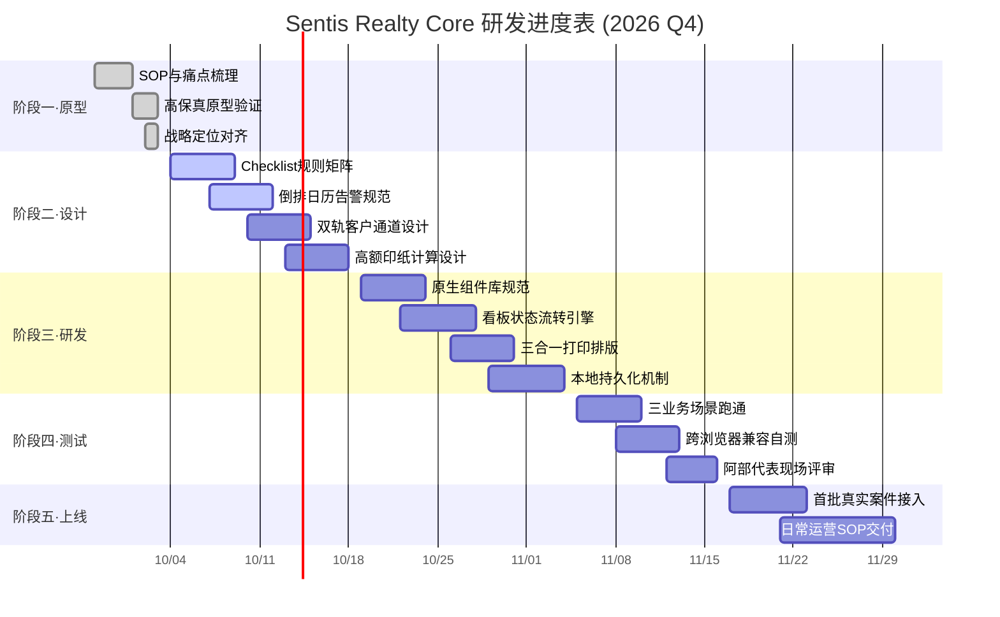

# Sentis 内部综合管理系统工程进度与里程碑规划 (Project Schedule)

> **案例标识**：`sentis-crm-system`  
> **工程代号**：Sentis Realty Core  
> **当前阶段**：**详细设计与组件架构阶段 (Detailed Design Phase)**  
> **编制日期**：2026-10-03 | **最新更新**：2026-10-03  
> **负责人**：Vanguard 平台架构组 & 代表阿部翔平

---

## 1. 工程阶段推进全景图 (Pipeline & Gantt)

### 1.1 阶段里程碑流转管线 (零重叠清晰视图)

### 1.2 详细甘特进度表 (Gantt Schedule)

---

## 2. 阶段性里程碑与交付物矩阵 (Milestones & Deliverables)

| 里程碑 | 周期区间 | 核心工作内容 | 关键交付物 (Deliverables) | 准出条件 (Exit Criteria) | 当前状态 |
| :--- | :--- | :--- | :--- | :--- | :---: |
| **M1: 需求与概念验证** | 09/28 - 10/03 | 梳理《売買契約の流れ》与《創業計画書》，确立高额不动产+海外客户定位 | • `01_overview.md` • `02_business_workflow.md` • `site/index.html` (原型v1) | 业务全流程 SOP 闭环，原型具备交互能力 | ● 已完成 |
| **M2: 业务引擎详细设计** | 10/04 - 10/18 | 细化动态 Checklist 判定表、决算倒排告警阈值、境内外双轨数据流 | • `03_system_requirements.md` (完善版) • Checklist 规则配置表 • 决算告警工期字典 | 规则覆盖公寓、一户建、法人卖主、海外买主等全部场景 | ● 进行中 |
| **M3: 纯静态前端系统研发** | 10/19 - 11/04 | 实现高质感纯静态 Vanilla 界面，完成状态流转、单据计算器与打印排版 | • `site/` 完整前端资产 • 三合一决算资料打印模板 • 案件本地增删改查交互 | 页面在本地浏览器（`file:///`）双击即开，控制台 0 报错 | ⚪ 待启动 |
| **M4: 真实案件集成测试** | 11/05 - 11/16 | 载入新宿公寓、世田谷一户建、麻布台高额单三套真实场景压力测试 | • 测试用例验证报告 • 边界异常排查表 (如印纸边界) | 三套案件全流程勾选与核算数据全部通过验证 | ⚪ 待启动 |
| **M5: 业务试运行与上线** | 11/17 - 11/30 | 交付 Sentis 团队投入第 1 期在办案件，赋能阿部翔平 2 人团队高效运转 | • 操作手册与业务备忘指引 • 系统正式版本归档 | 团队可脱离纸质备忘，完全依据系统进行决算推进 | ⚪ 待启动 |

---

## 3. 当前冲刺工作分解 (Current Sprint WIP - M2阶段)

### 3.1 详细设计任务清单 (Checklist)
- [x] **商业目标与技术定位融合**：完成将《創業計画書》3 年发展规划与高额房产业务融入系统定位。
- [x] **全链路业务流程规范化**：建立签约前【事前审查与买付】、签约、贷款、金消、决算各大阶段的 SOP 标准文档。
- [x] **系统管辖与外部协同边界划定**：确立 In-Scope 与 Out-of-Scope 边界矩阵，排除非现实自动承诺。
- [ ] **Checklist 规则引擎逻辑表定义**：
  - [ ] 规则 1：物件分类（一户建验房 / 公寓变更届与振替用纸）
  - [ ] 规则 2：卖方性质（法人 3 份重说 / 个人 4 份重说）
  - [ ] 规则 3：买方属地（在日无番号住民票 / 境外公证声明书［格式待定］）
  - [ ] 规则 4：佣金超额（超 3% 强制关联《支払約定書》［细则待定］）
- [ ] **决算倒排日历警报算法设计**：定义以决算日为基准的 $D-14$ / $D-10$ / $D-7$ / $D-2$ / $D-1$ 各级告警等级（红色强制、黄色提示、绿色完成）。
- [ ] **待定与合规待审议题推进**：
  - [ ] 境外大额外汇电汇受款银行 AML 反洗钱审查到账缓冲期（2~4周）［未定·要協議］
  - [ ] 非居住者预提所得税（10.21%）源泉征收扣缴与税理士委任流程［待定 / 税理士確認中］

---

## 4. 工程风险与应对策略 (Risk & Mitigation)

| 风险项 | 风险等级 | 潜在影响 | 防范与应对策略 |
| :--- | :---: | :--- | :--- |
| **管理会社邮寄延迟** | **高** | 决算前无法收到《管理费+修缮费振替用纸》，导致交房脱节。 | 系统在决算日前 10 天触发**强提醒**，生成“致电管理会社备忘与挂号信封确认项”。 |
| **住民票番号违规泄露** | **高** | 买方误开含个人番号的住民票，银行与司法书士拒收。 | 在客户 Checklist 中使用高亮红标警示，并在上传/核验时设置“无番号”强制确认复选框。 |
| **海外客户公证书时效** | **中** | 境外公证处出具声明书周期过长，影响契约与过户。 | 提前两周触发海外客户公证指引，提供多语言标准公证模板。 |
| **高额印纸税贴附遗漏** | **中** | 领收书超 100 万日元漏贴第 2 张印纸，存在审计合规风险。 | 财务结算工具内嵌逻辑锁，输入成交价与中介费后自动输出印纸张数与面额，一目了然。 |
